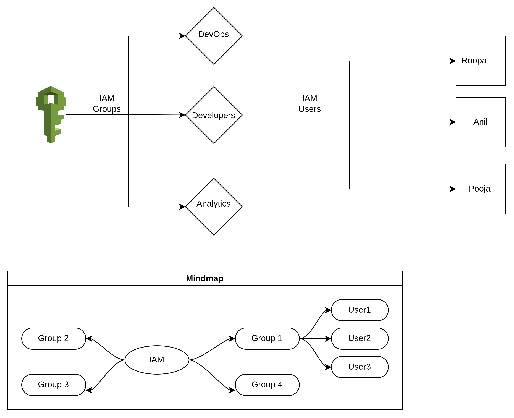

# 🚀 AWS IAM - Master Quick Reference Guide
**Version:** 1.0  
**Target:** Interview Prep & Daily On-the-Job Reference  
**Style:** Plain English + Analogies

---

## 🧠 1. THE MINDMAP (Text Hierarchy)

```text
AWS IDENTITY & ACCESS MANAGEMENT (IAM)
│
├──── 🏢 THE "WHO" (Identities)
│     │
│     ├── Root User (The Owner/Master Key)
│     │    └── Use ONLY for: Billing, Account Closure, MFA setup on root.
│     │
│     ├── IAM User (The Employee Badge)
│     │    └── Represents a Human or Application. Has a Password/Access Key.
│     │
│     └── IAM Group (The Team)
│          └── Attach policies to the Group. Users inherit them.
│
├──── 📜 THE "WHAT" (Permissions)
│     │
│     ├── Policy (The Rulebook - JSON format)
│     │    ├── Effect: "Allow" or "Deny"
│     │    ├── Action: What API call (e.g., s3:PutObject)
│     │    └── Resource: Which AWS ARN (e.g., arn:aws:s3:::my-bucket)
│     │
│     └── Role (The Temporary Badge)
│          └── For MACHINES (EC2, Lambda). No password. Auto-rotating credentials.
│
└──── 🛡️ THE "GUARDRAILS" (Security)
      │
      ├── MFA (Multi-Factor Authentication)
      │    └── Password + OTP from phone (Google Authenticator).
      │
      └── Password Policy
           └── Min 8 chars, Uppercase, Lowercase, Numbers, Symbols, Expire every 90 days.

```


---

## 🧩 2. THE "EVALUATION LOGIC" FLOWCHART

(How AWS decides YES or NO when you make a request)
```text
  User makes API Call (e.g., s3:DeleteObject)
                  │
                  ▼
      ┌───────────────────────┐
      │ Is there an EXPLICIT  │─── YES ──▶ ❌ DENIED (Stop here!)
      │ DENY for this action? │
      └───────────────────────┘
                  │ NO
                  ▼
      ┌───────────────────────┐
      │ Is there an EXPLICIT  │─── YES ──▶ ✅ ALLOWED
      │ ALLOW for this action?│
      └───────────────────────┘
                  │ NO
                  ▼
              ❌ DENIED
      (Implicit Deny by default)

```
---

## 📝 3. CHEAT SHEET: JSON POLICY TEMPLATES

### A. The "Read-Only" Policy (View S3)
Use this for Interns or Auditors.
```json
{
    "Version": "2012-10-17",
    "Statement": [
        {
            "Effect": "Allow",
            "Action": [
                "s3:GetObject",
                "s3:ListBucket"
            ],
            "Resource": [
                "arn:aws:s3:::your-bucket-name",
                "arn:aws:s3:::your-bucket-name/*"
            ]
        }
    ]
}
```

### B. The "Explicit Deny" (Protect critical files)
Use this to block specific users, even if they are Admins.
```json
{
    "Version": "2012-10-17",
    "Statement": [
        {
            "Effect": "Deny",
            "Action": "s3:DeleteObject",
            "Resource": "arn:aws:s3:::production-secrets/*"
        }
    ]
}
```

### C. Lambda-to-Lambda Invoke Permission
Attach this to Lambda A's Role to allow it to call Lambda B.
```json
{
    "Version": "2012-10-17",
    "Statement": [
        {
            "Effect": "Allow",
            "Action": "lambda:InvokeFunction",
            "Resource": "arn:aws:lambda:ap-south-1:123456789012:function:LambdaB"
        }
    ]
}
```
---

## ❓ 4. INTERVIEW Q&A (Crack the AWS Exam/Interview)
__Q1: What is the difference between an IAM User and an IAM Role?__

- __User__: Has permanent credentials (username/password or Access Keys). Used by Humans.

- __Role__: Has no password. Generates temporary credentials automatically. Used by AWS Services (EC2/Lambda) or for cross-account access.

__Q2: Your developer has Admin access. How do you stop him from deleting a specific S3 bucket?__

- Attach an **Explicit Deny** policy to his User or Group with _Effect: Deny_ for _s3:DeleteBucket_ on that specific bucket ARN. Remember: **Explicit Deny overrides Admin Allow!**

__Q3: You forgot your Root User password and lost your MFA device. How do you get back in?__

- AWS provides a **"Root user password reset"** link on the login page. You will need access to the email registered. For MFA, you must have saved the **MFA backup secret key** during setup. If not, you have to contact AWS Support (which is a painful process—always save that backup key!).

__Q4: Can a developer use the AWS CLI without giving them permanent Access Keys?__

- Yes! Have them log in to the AWS Console, go to the top-right "Command line or programmatic access" (under their username), and use the **"Get temporary credentials"** option. OR use **AWS IAM Identity Center (SSO)**. These credentials expire automatically.

__Q5: What is the "Least Privilege" principle?__

- It means granting only the minimum permissions required to perform a specific job. For example, if a Lambda only needs to read S3, give it _s3:GetObject_, not _s3:*_ (which would allow delete/upload).

---

## 📚 5. THE GOLDEN RULES (Senior Dev Wisdom)

| Rule # | The Rule                                                | Why?                                                                 |
|--------|---------------------------------------------------------|----------------------------------------------------------------------|
| 1      | Never log in as Root User unless absolutely necessary.  | Root has the "Master Key." One mistake deletes the whole account.    |
| 2      | Attach policies to Groups, not individual users.        | You don't want to manage permissions for 50 users one by one.        |
| 3      | Use Roles for EC2/Lambda. Never hard-code Access Keys.  | Hard-coded keys are easily leaked on GitHub (seekh lo, it happens!). |
| 4      | Enable MFA for EVERY human user.                        | Passwords get stolen. OTP saves your life.                           |
| 5      | Use Explicit Deny to protect your "Crown Jewels."       | It acts as a fail-safe even if Admin access is misused.              |
| 6      | Always test new policies in the Policy Simulator first. | Saves you from breaking production deployments.                      |

---

## 📝 6. COMMAND LINE SHORTCUTS (AWS CLI)
Assuming you have the AWS CLI installed and configured.

| Task                                 | CLI Command                                                                                        |
|--------------------------------------|----------------------------------------------------------------------------------------------------|
| List S3 buckets                      | aws s3 ls                                                                                          |
| Upload file to S3                    | aws s3 cp file.txt s3://my-bucket/                                                                 |
| Delete file from S3                  | aws s3 rm s3://my-bucket/file.txt                                                                  |
| List IAM users                       | aws iam list-users                                                                                 |
| Assume a Role (get temp credentials) | aws sts assume-role --role-arn arn:aws:iam::123456789012:role/MyRole --role-session-name MySession |

---

## 🎯 7. FINAL "SMART" CHECKLIST
Use this checklist when setting up a new AWS project:

□ Root User has MFA enabled.

□ Root User's Access Keys are deleted (never use them).

□ At least 1 Admin IAM User created with MFA for daily use.

□ Password Policy set to enforce strong passwords (Min 8 chars + expiry).

□ Developers are placed in Groups based on their role (Devs, Admins, ReadOnly).

□ EC2/Lambda functions are using Roles, not Access Keys.

□ All critical buckets/databases have an Explicit Deny policy to prevent accidental deletion.

---

## 📞 Final Words

"In AWS, if it's not working, 90% of the time it's an IAM permission issue. Check your policies first!"

**Pro Tip for Interviews:** When answering any AWS architecture question, always start with:
"First, I will set up the IAM roles and policies to ensure least privilege..."
This immediately tells the interviewer you are a **security-conscious Senior Dev.**